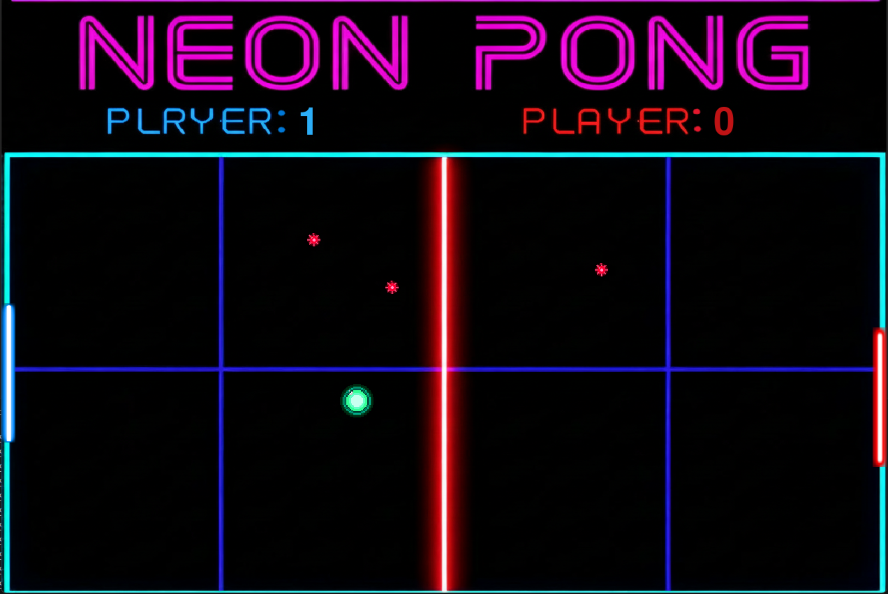

# Neo_ping-pong - учебная 2D-игра Python (Pygame)
Проект выполнен в учебных целях!

---
Это небольшая учебная игра, представляет собой обычный пинг-понг, но с минами. Они появляются после каждого соприкасновения ракетки с мячом. При соприкасновении мины с мячом она взрывается, мяч отскакивает с ускорением. Игрок управляет ракеткой, двигаясь строго по вертикали. Цель — отбить мяч.

# Управление:
W/S — вверх/вниз (Player 1)

↑/↓ — вверх/вниз (Player 2)

# Установка 
##Через GIT
Клонируй репозиторий:
```bash
git clone https://github.com/Kontorin/neo_ping-pong.git
```
Перейдите в папку проекта
```bash
cd neo_ping-pong
```
Активируем виртуальное окружение:
```bash
source venv/Scripts/activate
```
Запусти игру:
```bash
py main.py
```

